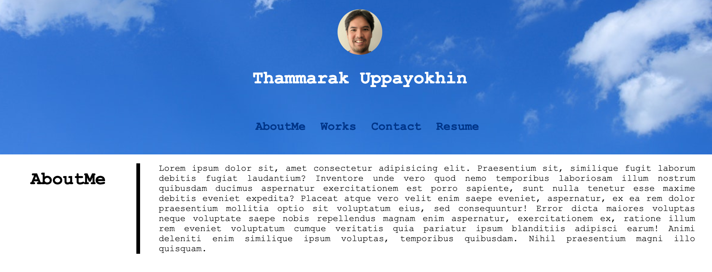
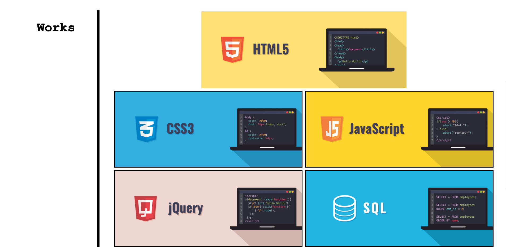
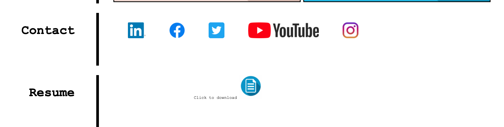

# Homework 02 - Advanced CSS Portfolio

## Objective : 
The objective of this homework is to create a portfolio by using HTML and CSS that we have learned so far.
This portfolio has been uploaded to the github pages. It will be updated through out the course and will be used for future career portfolio.

## Application :

### Github Repository URL
https://github.com/thammaraku/thammaraku.github.io.git

### Github Page URL
This will become my official portfolio page.
https://thammaraku.github.io/

### Screenshot Desktop

## Acceptance criteria Checklist 
1. This portfolio consists of required information.
    - name
    - photo
    - links to the developer's name, projects and contact information

2. All the links are working and navigating to the coressponding sections.
3. Resonive layout changes following various screen sizes.

## What we learned
1. How to layout the page by using both float and flexbox.
2. How to use media query to adjust the look of web page across devices.
3. How to make the page reponsive with user actions.
4. How to make a link for a file to download.
5. How to put backgorund image on sections.

## License
No license required on this public web page.